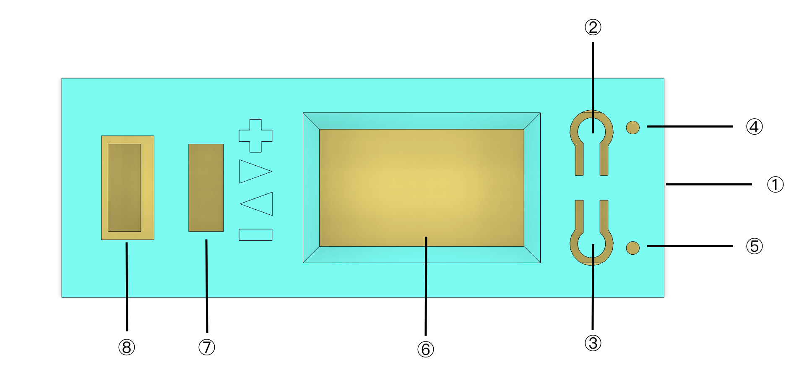
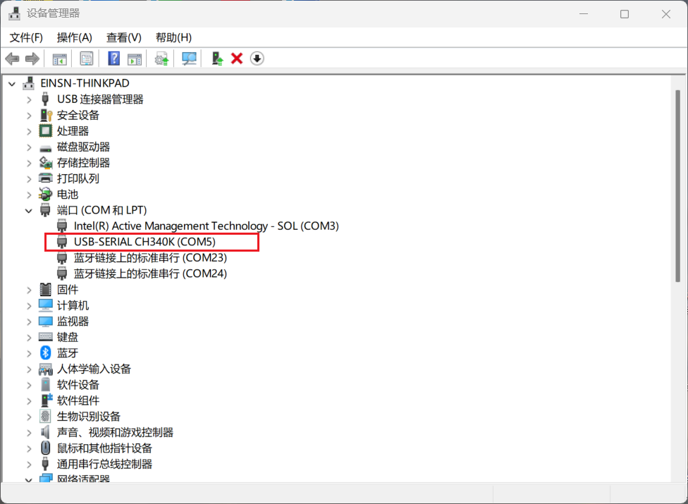
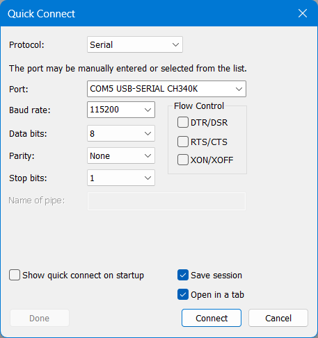
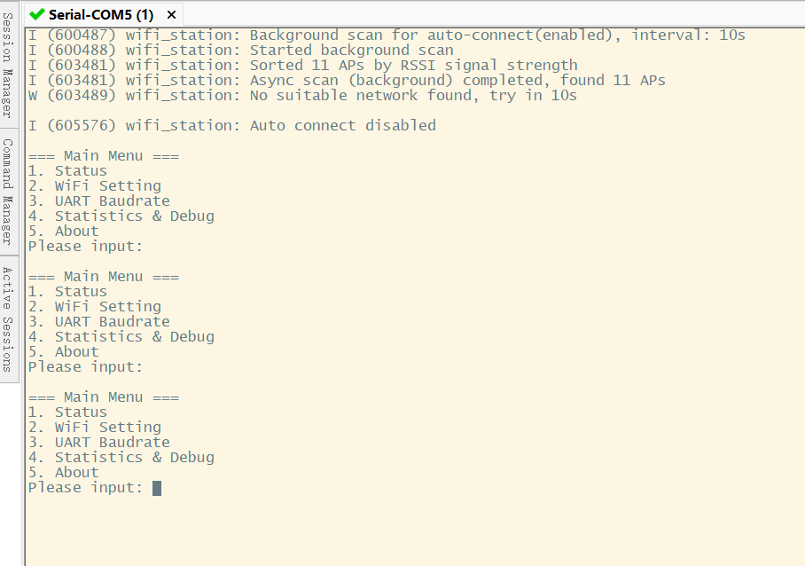
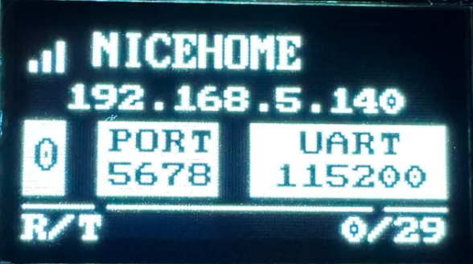
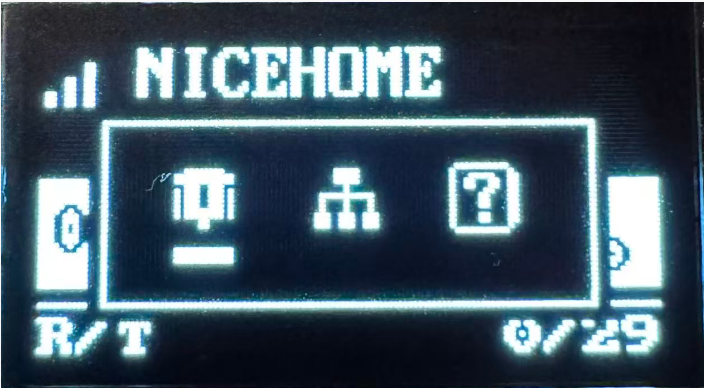

## 概述

这是一个基于ESP32C3模组实现的一个带屏无线串口的调试工具使用说明书。

### 主要特性

- ✅ 使用｢**向导式命令行**｣进行配网，操作简单
- ✅ 可存储8个WIFI网络，支持开机自动连接
- ✅ 支持多种常用波特率 <br>
 包括：9600，19200，38400，57600，115200，230400，460800，921600，1500000
- ✅ 屏幕支持显示IP地址、IP端口号及串口波特率
- ✅ 可通过按键快速切换串口波特率
- ✅ 可通过按键快速切换WIFI网络
- ✅ 屏幕支持显示UART统计信息
- ✅ 可连接多个TCP客户端

### 局限性

- ❌ 暂时不支持中文字符，如果WIFI的SSID有中文，无法正确显示出来。
- ❌ 串口参数仅支持修改波特率，其它参数如停止位，校验位均为常规配置，不支持修改。
 
## 接口定义

设备有一些交互接口，定义如下：



- ① USB Type-C接口
- ② ｢RESET｣按键
- ③ ｢BOOT/功能｣复用按键
- ④ 网络状态指示灯
- ⑤ 电源状态指示灯
- ⑥ 屏幕
- ⑦ 4-pin 串口接口1
- ⑧ 4-pin 串口接口2

## 连接到｢向导式命令行｣


设备有一个USB Type-C接口，提供一个串口连接，提供｢向导式命令行｣对设备进行管理。

连接步骤如下（以Windows为例）：
1. 将设备通过USB Type-C数据线连接到电脑，打开｢**设备管理器**｣，确定对应的串口名称。



2. 打开｢**SecureCRT软件**｣（或其他类似的串口工具，如Putty），点击｢**快速连接**｣，在弹出的对话框中，输入以下串口参数：
- 设备的串口号
- 串口参数：**波特率115200，数据位为8位，无校验位，停止位为1，取消所有流控选项**



3. 点击｢**连接**｣进入命令行，然后输入｢**回车**｣激活命令行菜单。

连接成功后，显示的菜单内容如下图所示：



注意：
该串口也可以作为固件烧录接口使用。

## 屏幕与按键

**主屏幕效果图**



- 首行为WIFI信号图标及WIFI网络SSID
- 第二行为获取的IP地址
- 第三行从左到右依次为：TCP客户端连接数，TCP端口号，串口波特率
- 第四行为串口收发统计信息

**菜单弹出框**



- 从左到右依次为：串口波特率，网络切换，帮助页。

｢功能｣键可以用来操作屏幕菜单，定义如下：

- ｢单击｣进入菜单或切换菜单选项。
- ｢双击｣确认选项或退出当前页面。

## 配网与网络切换 

### 配网

网络配置必须通过｢**向导式命令行**｣来实现。

按照｢**连接到向导式命令行**｣中的说明，进入命令行菜单，如下图所示：

```sh
=== Main Menu ===
1. Status
2. WiFi Setting
3. UART Baudrate
4. Statistics & Debug
5. About
Please input: 

```

- 输入“2”，然后｢**回车**｣，进入子WIFI设置子菜单, 如下图所示：

```sh
=== WiFi Setting ===
1. Auto Connect
2. Scan & Connect
3. Disconnect
4. List Networks
5. Delete Network
6. Add Network
--------
0. Exit
--------
Please input: 
```
- 继续输入“2”， 然后｢**回车**｣，设备开始扫描网络，网络扫描完成后，进入网络选择子菜单，如下图所示：

```sh

=== WiFi Scan & Connect ===
Scanning...
Found 17 networks:
1. XXZXS-2.4G                       RSSI: -31 
2. XXZXS-2.4G                       RSSI: -52 
3. parkline                         RSSI: -54 
4. 灯控专用-2.4G                    RSSI: -56 
--------
0. Exit
--------
Please input network index: 1

Selected network: XXZXS-2.4G
Please input password: 66668888

Start connecting to XXZXS-2.4G...
Connected to XXZXS-2.4G successfully
--------
Input [Enter] to return

```

- 在网络列表中选择想要的网络，输入对应的网络编号即可，｢**回车**｣继续；
- 设备随即提示输入网络密码，输入完成后，｢**回车**｣继续。
- 等待网络连接成功后，可以在屏幕上显示SSID及获得的IP地址。

### 连接多个网络

可以通过重复上面｢**配网**｣的操作连接多个WiFi网络，设备最多可以保存8个网络。<br>
设备开机时，如果有多个可用网络在线，设备会自动选择网络信号最好的网络连接。

### 网络切换
在多个可用网络环境下，如果你想切换网络，可以通过以下两种方式实现:

**通过屏幕菜单操作**

① 在屏幕处于主页面时，单击｢**功能键**｣，唤醒弹出菜单 <br>
② 在弹出菜单中，通过单击｢**功能键**｣切换选项，选中中间“网络”图标即可 <br>
③ 双击｢**功能键**｣进入网络选择子页，设备会自动触发网络扫描<br>
④ 如果有多个可用网络，会依次在屏幕中显示，可以通过单击｢**功能键**｣来切换想要选择的网络<br>
⑤ 双击｢**功能键**｣确认选中的网络，设备随后开始连接到选中网络，并返回主页<br>


**通过命令行操作**

参考｢**配网**｣的操作流程，连接指定网络即可。

### 修改波特率

可以通过以下两种方式，修改串口波特率:

**通过屏幕菜单操作**

① 在屏幕处于主页面时，单击｢**功能键**｣，唤醒弹出菜单 <br>
② 在弹出菜单中，通过单击｢**功能键**｣切换选项，选中中间“串口”图标即可 <br>
③ 双击｢**功能键**｣进入串口波特率选择子页，然后可通过单击｢**功能键**｣来切换想要设定的波特率。<br>
④ 双击｢**功能键**｣确认选中的波特率，设备执行波特率配置操作，并返回主页。

**通过命令行操作**

在｢**向导式命令行**｣中，也可以通过命令行来实现串口波特率修改。进入命令主菜单后，输入“3”（UART Baudrate），然后按提示操作即可。

## 通过网络连接到串口

设备在连接到指定网络后，会开启一个TCP服务，用户可以使用一些工具软件，连接到设备的TCP服务即可对串口进行读写操作。

TCP服务的端口号为**5678**。

一些支持RAW模式的TCP连接的终端软件如下：

- [WindTerm](https://github.com/kingToolbox/WindTerm)，支持windows，Linux，Macos

- SecureCRT 

- Putty

- 其它TCP/IP调试工具
